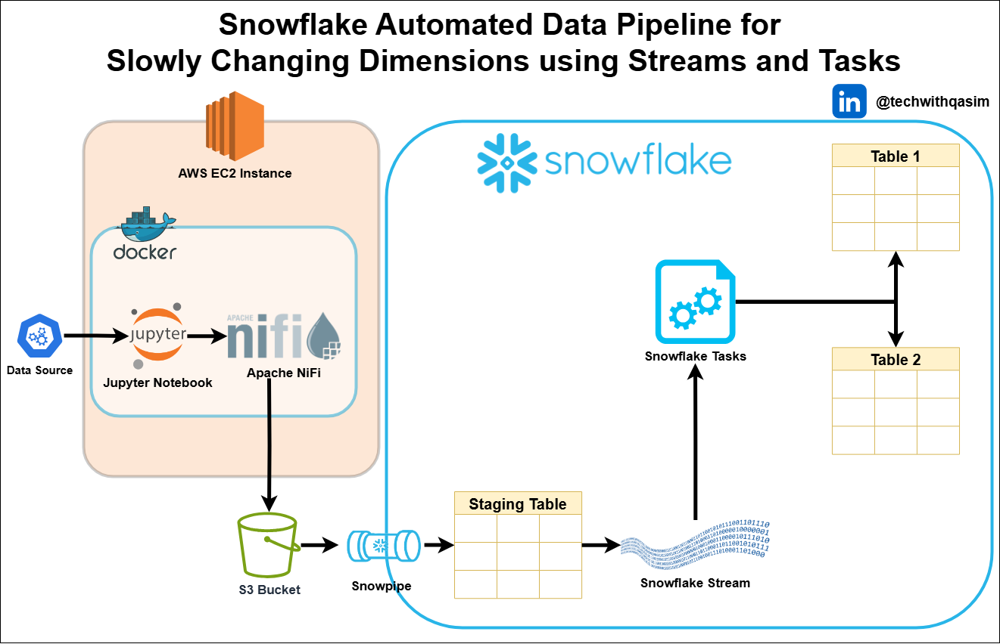

# Automated SCD Data Pipeline with Snowflake, NiFi, Jupyter, Docker, Snowpipe, Streams, and Tasks

This repository contains an end-to-end data pipeline designed to handle Slowly Changing Dimensions (SCD) using Snowflake and modern data engineering tools. The architecture leverages automation and scalability to efficiently manage historical data changes in a data warehouse environment.

**Project Overview**

The pipeline automates data ingestion, transformation, and SCD handling by utilizing the following components:

- Apache NiFi – Ingest and preprocess data from various sources.
- Jupyter Notebook – Orchestrate preprocessing and data preparation tasks.
- Docker – Containerize the environment for easy deployment and scalability.
- Amazon S3 – Store and stage raw data files.
- Snowpipe – Continuously load data from S3 into Snowflake.
- Snowflake Streams – Detect and track changes in staging tables.
- Snowflake Tasks – Automate table updates and handle SCD logic.

**Architecture**

1. Data Source → Ingested via NiFi running in Docker
2. Data is stored in S3 Buckets
3. Snowpipe loads data into a Staging Table in Snowflake
4. Streams track changes (new, updated, or deleted rows)
5. Tasks apply transformations and update dimension tables (SCD Type 1 or 2)

**Key Features**

- Automated Ingestion: No manual intervention required for continuous data loading.
- Real-time Change Detection: Tracks row-level changes using Snowflake Streams.
- Scalable: Easily scales with Docker and Snowflake’s elastic architecture.
- Cost-Effective: Leverages Snowflake’s pay-as-you-go model for efficient resource usage.
- Modular Design: Components can be reused and extended for different use cases.

**Use Cases**

- Data Warehousing
- ETL Pipelines
- Historical Data Tracking
- Business Intelligence